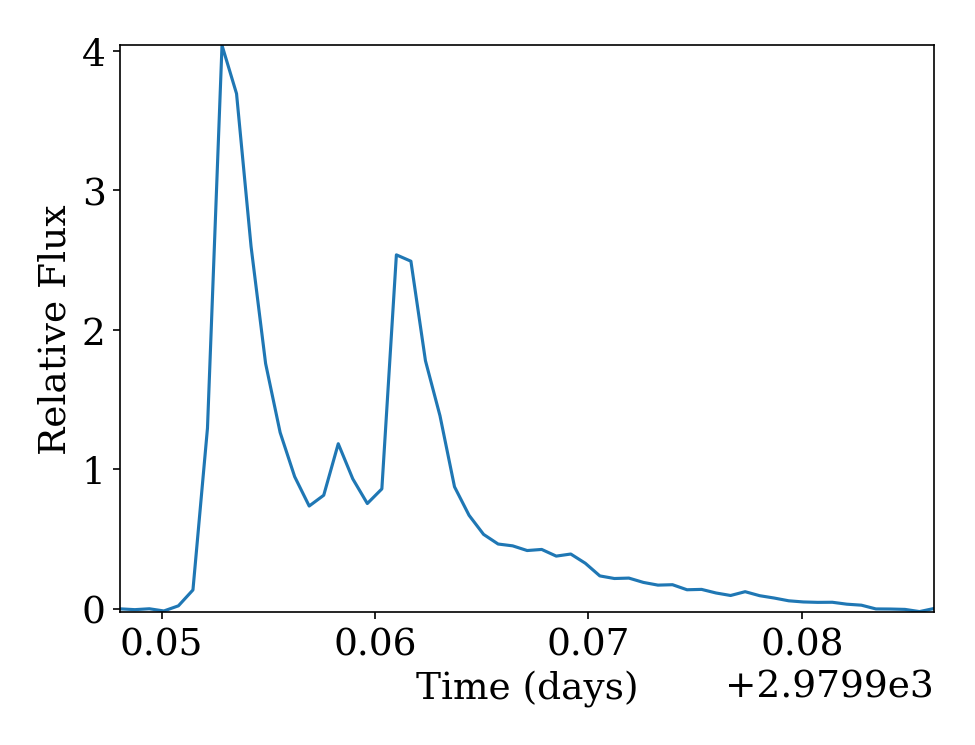
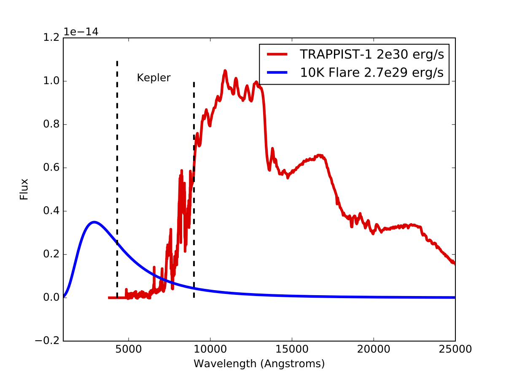
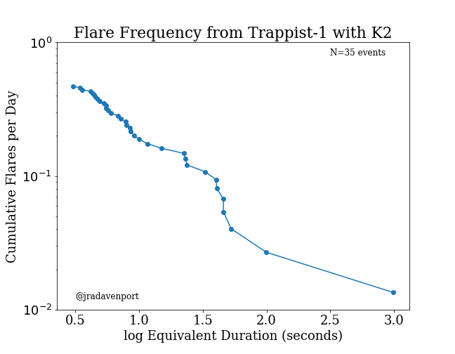

# Flares from TRAPPIST-1 with K2

By James Davenport (@jradavenport), Rishi Paudel, and John Gizis (@jgizis)

This is an IPython notebook exploration of the raw K2 light curves released for TRAPPIST-1, and is listed on the [MAST page](https://archive.stsci.edu/k2/trappist1/) for this target as a useful guide finding and studying flares in the light curve.

Flares in this work were identified by manual inspection of the light curve using [FBEYE](https://github.com/jradavenport/FBEYE) from [Davenport et al. (2014)](http://arxiv.org/abs/1411.3723).

The largest flare, first identified by Tom Barclay (@mrtommyb) on Twitter a couple hours after the data were made public, is a large amplitude, "complex" event.

A majority of the flares are between 20 and 40 minutes in total duration, comparable to the most active stars observed in the Kepler mission.

Note [Vida et al (2017)](https://arxiv.org/abs/1703.10130) have reproduced these results, but use a different quiescent energy level. Our "equivalent durations" are converted to energies using the zeropoint calculated as in [Gizis et al. (2017)](https://arxiv.org/abs/1703.08745) assuming a 10,000 K blackbody for the flare spectrum.

This notebook made the first flare frequency distribution measurement for this star, which indicated a "superflare"-like event occurs on TRAPPIST-1 approximately once per year. While this is lower than the rate for Proxima Cen [(Davenport et al. 2016)](https://arxiv.org/abs/1608.06672), it may still be a high enough occurrence rate to strip the atmosphere from any of the 3 potentially habitable orbiting planets.

